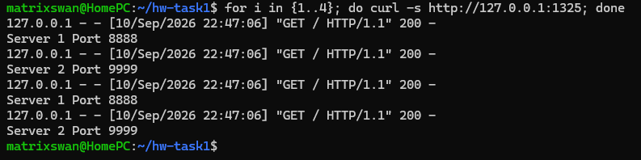
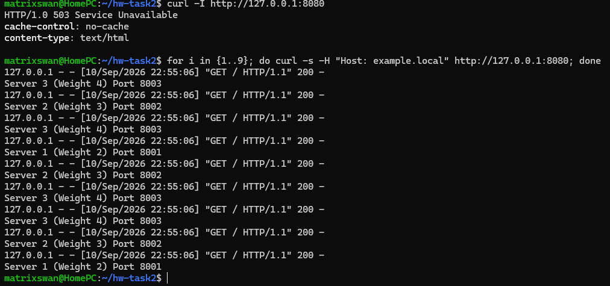

# Домашнее задание к занятию "Кластеризация и балансировка нагрузки" - Сидоренко Алексей

---

> **Примечание:** В связи с нахождением в командировке, все задания были выполнены на одной локальной машине (WSL). Для эмуляции распределенной среды и кластера использовались разные сетевые порты и локальный файл `/etc/hosts` для маршрутизации по доменным именам.

---

### Задание 1

1. Запущены два простых Python-сервера на портах `8888` и `9999`.
2. Установлен и настроен HAProxy. Для балансировки на 4-м уровне (TCP) использована секция `listen` с явным указанием `mode tcp`.

**Конфигурация HAProxy:**
- [haproxy-task1.cfg](configs/haproxy-task1.cfg)

**Доказательство работы:**
На скриншоте ниже виден результат выполнения команды `for i in {1..4}; do curl -s http://127.0.0.1:1325; done`. Запросы равномерно распределяются между серверами по алгоритму Round-robin.

---

### Задание 2

1. Запущены три Python-сервера на портах 8001, 8002 и 8003.
2. В файл `/etc/hosts` добавлена запись для эмуляции домена: `127.0.0.1 example.local`.
3. Настроен HAProxy на 7-м уровне (`mode http`) с использованием ACL для проверки заголовка `Host` и параметра `weight` для серверов.

**Конфигурация HAProxy:**
- [haproxy-task2.cfg](configs/haproxy-task2.cfg)

**Доказательство работы:**

- **Запрос без указания домена:** HAProxy возвращает ошибку `503 Service Unavailable`, так как правило маршрутизации срабатывает только при совпадении заголовка `Host`.
- **Запрос с доменом `example.local`:** Выполнено 9 запросов. Распределение ответов строго соответствует заданным весам: Server 1 ответил 2 раза, Server 2 — 3 раза, Server 3 — 4 раза (сумма = 9).

